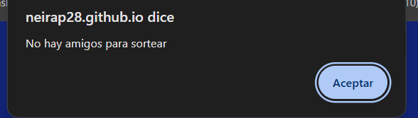
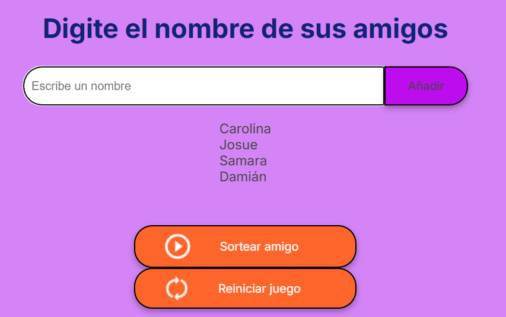
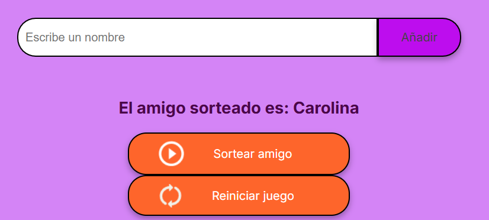

# Descubre a tu amigo secreto.

**Descubre a tu amigo secreto** es un pequeño proyecto en donde se sortea una lista de amigos de forma aleatoria y se escoge a uno por medio de un algoritmo.  Tiene como objetivo principal poner en práctica la lógica de programación aprendida en la primera fase del programa Oracle Next Education. 
Por supuesto, requiere algunas mejoras que iré implementando poco a poco. Mientras, dale un vistazo a mi código. ¡Gracias por visitar!

## Demo

[¿Te gustaría jugar? Presiona aquí.](https://neirap28.github.io/challenge-amigo-secreto_one/)

## Features

- Activa otra alerta si el usuario da clic en el botón de “añadir” sin haber introducido ningún nombre.

- Activa una alerta si el usuario da clic en el botón “sortear amigo” sin haber introducido ningún nombre y creado una lista

- Crea una lista y sortea de forma aleatoria un nombre para descubrir al amigo secreto. 

- Realiza el sorteo y limpia el campo donde se escriben los nombres

- Restablece las funciones iniciales mediante el botón/assets/amigo-sorteado.png/ “reiniciar juego”.

